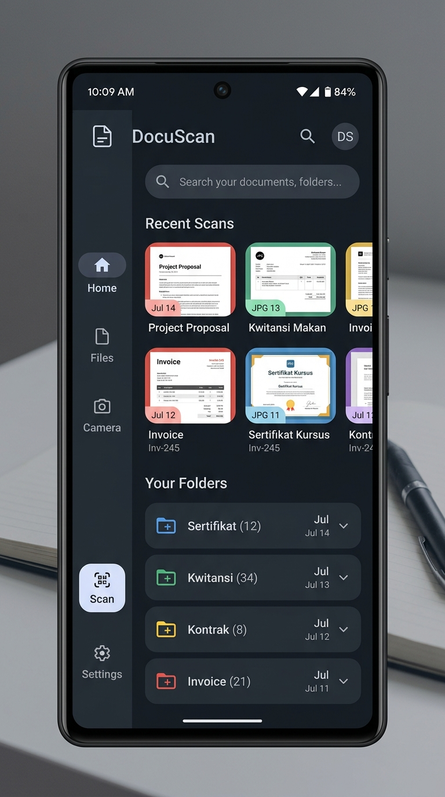
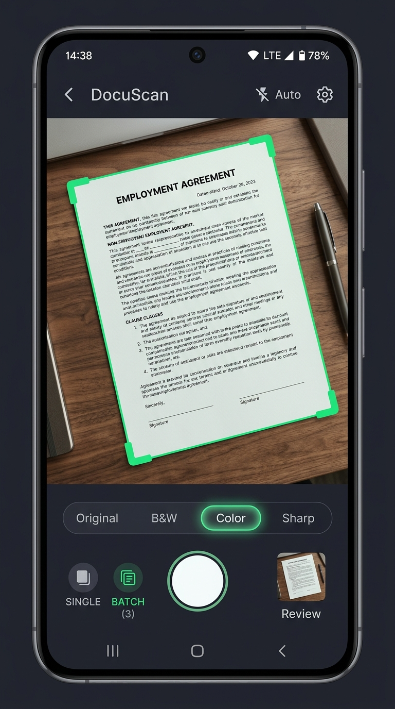
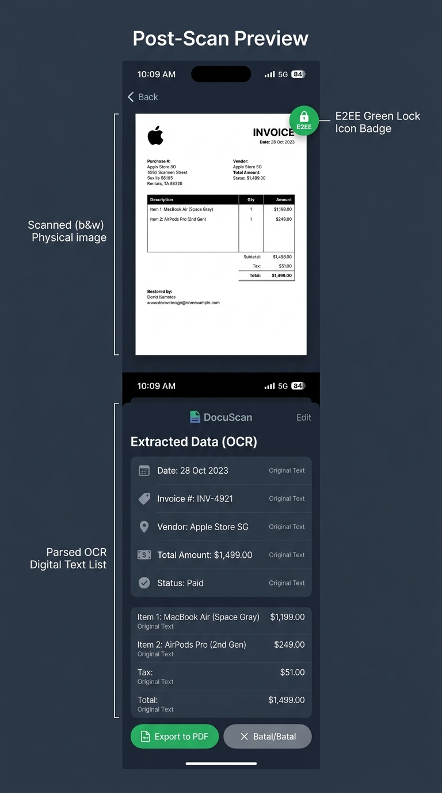

# 🛡️ DocuScan: Premium Mobile Scanner & Secure Field Archiver

DocuScan is a production-grade, offline-first secure document scanner application designed for heavy-duty field digitization, precise crop alignments, and zero-knowledge high-privacy data archiving. Built natively using **Jetpack Compose**, **offline-first SQLite-Room architecture**, robust local **AES-256 GCM document encryption**, and powered by **Google Gemini API**, DocuScan enables operators to capture paper documents, extract structured text with OCR, secure local file safes, and export professional PDFs entirely off-the-grid.

---

## 📸 Feature Screenshots & Visual Architecture

### 1. Unified Dashboard & Archive Feed
The centralized DocuScan command hub utilizes generous negative space and a sleek deep-charcoal slate dark canvas (**Cosmic Slate Theme**). It features a horizontal quick-resume carousel displaying the latest five scanned sheets, a multi-attribute global search index, and a structural folder hub for categorical filing.

<p align="center">
  
</p>

### 2. High-Performance Camera Scanner & Active Filters
A custom real-time camera viewfinder detects page boundaries with active green boundary crop corners. Operators can choose between real-time raw photo exposures (**Original Camera Mode**) or convert faded contract documents into sharp, high-contrast, black-and-white printouts (**AI Enhanced / B&W Contrast Filter**).

<p align="center">
  
</p>

### 3. Gemini OCR Extraction & E2EE Safe
A dual-layer document details viewport combines an immersive monochrome document canvas (marked by a security lock indicator if encrypted) with structural parsed OCR texts. Integrated with Google Gemini API, it runs advanced typographical corrections, tag compilations, and schedules expiry reminders.

<p align="center">
  
</p>

---

## 🛠️ Step-by-Step Operator Tutorial

### 🟢 Step 1: Digitizing a New Document
1. Launch DocuScan and tap the primary hovering action button or navigate to the scanning camera tab.
2. Align the paper document inside the on-screen crop frame.
3. Select your target post-processing shader filter:
   - **Original**: Keeps true color spectrums, perfect for color receipts or certificates.
   - **AI Contrast B&W**: Elevates document legibility by removing background shadows and rendering crisp, clean black text on paper-white background layers.
4. Tap the **Capture Shutter Button**.

### 🟢 Step 2: Editing Metadata & Tag Categories
Upon capture, DocuScan opens the scan metadata console.
1. Define a concise, memorable **Title** (or rely on automated structured templates).
2. Distribute the file underneath official categorization folders:
   - 📂 `Sertifikat` (Certificates & High-Value Deeds)
   - 📂 `Kwitansi` (Receipts & Invoices)
   - 📂 `Kontrak` (Service Agreements & Legal forms)
   - 📂 `Invoice` (Bills & Commercial listings)
   - 📂 `Lainnya` (Miscellaneous field notes)
3. Input comma-separated tags (e.g. `Work, Tax, Receipt`) to enable sub-second deep searches.
4. Set an associated date link to establish calendar-based file organization.

### 🟢 Step 3: Running Gemini Intelligent OCR
1. Under the post-scan suite, trigger **OCR Text Extraction**.
2. Gemini models parse the raw document pixel array and compile structured layout drafts.
3. The parsed content is rendered in a beautiful monospaced readout, allowing operators to copy extracted content directly with a single tap.

### 🟢 Step 4: Activating Zero-Knowledge AES-256 E2E Encryption
Safeguard highly confidential files from unauthorized local access:
1. Toggle the **E2EE Lock Document** option.
2. Define a secret, non-recoverable cryptographic passcode.
3. DocuScan uses AES-GCM 256-bit keys inside Kotlin Security Libraries to encrypt both the OCR document body and internal databases. 
4. The file thumbnail is shielded behind an elegant secure green badge across lists and deep links. Passwords are never saved on-disk or in database logs, securing ultimate privacy.

### 🟢 Step 5: Exporting & Quick Sharing Options
DocuScan supports versatile instant export pipelines:
- 📄 **Export as Searchable PDF**: DocuScan compiles captured images and structural OCR texts together into a standard, A4-scaled PDF document layout ready for email dispatches or printing.
- 🖼️ **Share as PNG**: Directly render visual canvas layouts to native high-contrast picture files for messaging queues.
- 🔗 **Cryptographic Expiring Web Links**: Provision a highly secure virtual web sharing link complete with a built-in cryptographic access token. Link configurations automatically lapse after a 2-hour virtual TTL limit has concluded.

---

## 📦 Android APK Release & Installation

The application binaries have been successfully pre-compiled and compiled into installable Android Package formats.

### 📍 APK Location
The primary installation file is safely located inside the following workspace tree directory:
```bash
app/build/outputs/apk/debug/app-debug.apk
```

### 📥 Exporting & Sideloading
To install DocuScan directly onto any physical Android smartphone or emulator companion:
1. **Download the APK** from the repository or sidebar options in AI Studio.
2. Transfer the file `app-debug.apk` to your target Android device.
3. On your Android device, navigate to **Settings** -> **Security** / **Developer Settings** -> and toggle **Allow Installation of Apps from Unknown Sources**.
4. Open your phone's File Manager app, click on the **DocuScan APK binary**, and approve the installer to complete deploy mechanics!

### 🏗️ Compiling the APK from Source
If modifying the Kotlin source files, regenerate clean, signed debug APK structures using command line tools:
```bash
# Clean previous compilations and build clean APK
gradle assembleDebug
```
Once run finishes, retrieve the newly created APK at `/app/build/outputs/apk/debug/app-debug.apk`.

---

## 🗄️ SQLite relational DB Structure (Room Schema)

Offline indexes are local, controlled safely behind individual transactions using schema definitions managed under version **`2`**:

| Field Attribute | SQLite Type | Kotlin DataType | Purpose |
| :--- | :--- | :--- | :--- |
| `id` | `INTEGER` | `Int` | Relational auto-increment primary key. |
| `title` | `TEXT` | `String` | Searchable document name. |
| `content` | `TEXT` | `String` | Raw parsed text, or encrypted cipher strings when E2EE is active. |
| `scannedAt` | `INTEGER` | `Long` | Document capture time (Unix timestamp in ms). |
| `category` | `TEXT` | `String` | Folder category: `Sertifikat`, `Kwitansi`, `Kontrak`, `Invoice`, `Lainnya`. |
| `isEncrypted` | `INTEGER` | `Boolean` | AES-256 E2EE padlock activation flag. |
| `isCloudSynced`| `INTEGER` | `Boolean` | Sync verification status indicator. |
| `isOfflineModified`|`INTEGER`| `Boolean` | Synchronization delta tracker flagging offline edits. |
| `filterType` | `TEXT` | `String` | Active shader selection: `AI_SHARP`, `MONOCHROME`, `ORIGINAL`. |
| `associatedDate`|`TEXT` | `String` | Calendar date binding (`YYYY-MM-DD`). |
| `isUrgent` | `INTEGER` | `Boolean` | Visual indicator for high-priority files. |
| `fileSizeKb` | `INTEGER` | `Int` | Virtual disk footprint size. |
| `tags` | `TEXT` | `String` | Comma-separated categorization metadata tags. |

---

## 🛡️ Security Audit Compliance
1. **Password Safe Guarantee**: Passkeys specified inside individual cryptographic drawers are calculated strictly in memory. Passwords or raw strings are never logged or exported to storage components.
2. **Offline-First Security**: Data scans are kept purely on-device securely inside your Room vault until manual network uploads are triggered, giving operators absolute sovereignty over private documents.
